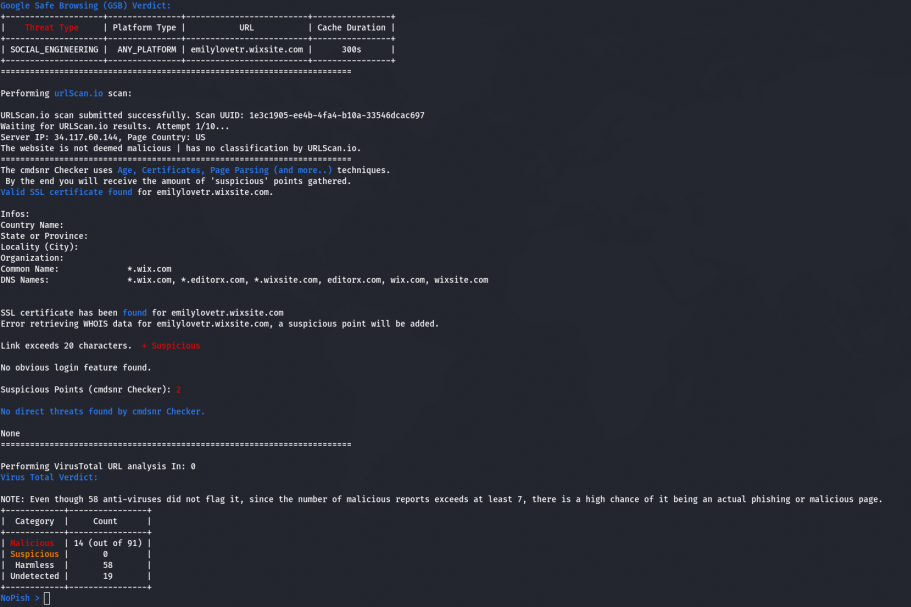
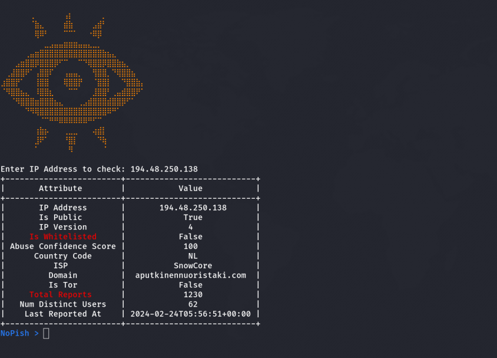
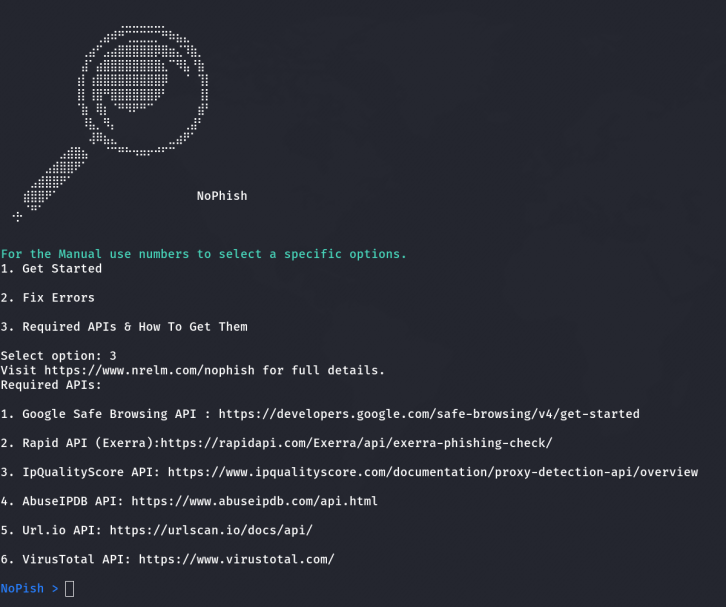
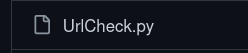
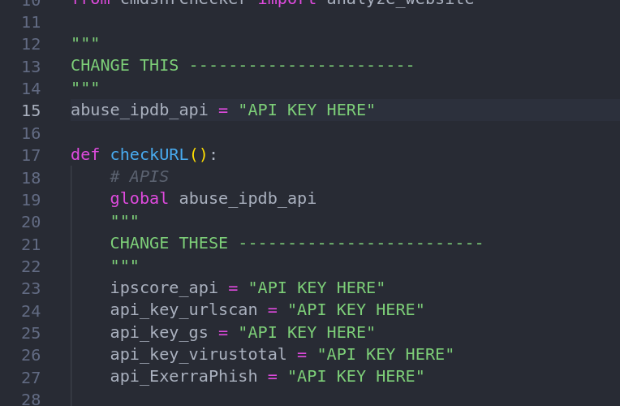

# NoPhish
Phishing detection tool through the use of several APIs checking against the most trusted databases, while additionally having a self-made phish checker and most importantly, completely free of charge APIs.

[](https://git.io/typing-svg)


- Tested on:
```

-------------------
|   OS    |   ?   |
|---------|--------
|  Linux  |   ✅   |
|-------- |--------
| Windows |   ✅   |
|-------- |--------
|  MacOS  |   ✅   |
--------------------

```


## Usage & Demo.
If you haven't completed the requirements, take a look at the requirements section or https://nrelm.com/nophish for more informations.

- When it comes to a malicious website / phishing page, sometimes they're made persuasive enough to trick you. But just in case, it doesn't hurt to check as cyber safety should be your primary concern when browsing online.

- As you can see on the screenshots below, using NoPhish to scan a malicious website, we may receive different outputs from different services who's verdicts can be either malicious or not, however if one of the verdicts are deemed malicious, there is a chance that someone has already reported the website, therefore making it potentially malicious! See screenshots below:



- The IP reputation scanner uses the `AbuseIPDB` API to check for a specific ip address against their database. Example usage:


- The Manual is simple, it contains basic informations as to where to get the APIs from & where to go if you face potential issues. (simply links to the github issues page.)



## Requirements
NoPhish Requires:
 - `Python 3.x` + (At least python 3.x +)
 Make sure python is added to path on `windows`, usually it comes pre-installed on linux distirbutions.

Visit `https://www.nrelm.com/nophish` for full details.

Required `APIs`:

1. Google Safe Browsing API : https://developers.google.com/safe-browsing/v4/get-started 

2. Rapid API (Exerra):https://rapidapi.com/Exerra/api/exerra-phishing-check/ 

3. IpQualityScore API: https://www.ipqualityscore.com/documentation/proxy-detection-api/overview 

4. AbuseIPDB API: https://www.abuseipdb.com/api.html 

5. Url.io API: https://urlscan.io/docs/api/ 

6. VirusTotal API: https://www.virustotal.com/ 
- Sign up for an account & get your free API key. Then nagivate to `UrlCheck.py`:
You can now deploy!

## Deploy
- Firstly, either download the .zip file manually and extract it, or simply:
```
git clone https://github.com/sytaxus/NoPhish.git
```
- Secondly, make sure you're inside the project's directory, so: `cd NoPhish`
- Now, install the required libraries using : `pip install -r requirements.txt`

- Now replace the required `APIs` by going to `UrlCheck.py`:

- Then navigate to:

- Now replace your API keys and finally deploy!
- Finally, you can deploy using: `python NoPhish.py` or `python3 Nophish.py` depending on your system.


## FAQs
1. Is there a difference between using domain names or a full url using http / https?
`It doesn't matter. You can scan using domain-only or full URL.`

2. Are all of the APIs free?
`Yes, all of the APIs are completely free of use by the time of NoPhish's release.`

3. Is the project going to be supported?
`Yes, i'll keep updating it for now.`
